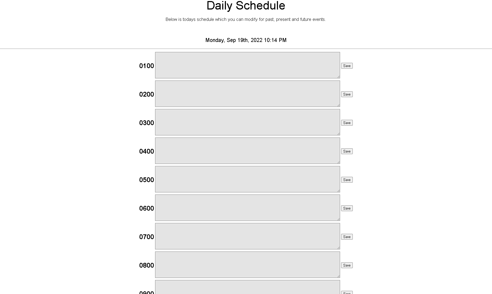

# operation-itenerary
A webpage where you can make a schedule 

## Description
This web application is meant as an easy to use schedule. A user can type whateever they want into the text boxes and it will appear on the scheduel with the time. The user can then save their schedule and add more things to it later

## Installation 
* Open the index.html file in a new window to see web application.
* Open deployed link below in a new window to see web application.

## Preview

## Deplyed link 
[Deployed Webpage]

## Credits 
Eduardo Figueroa 
